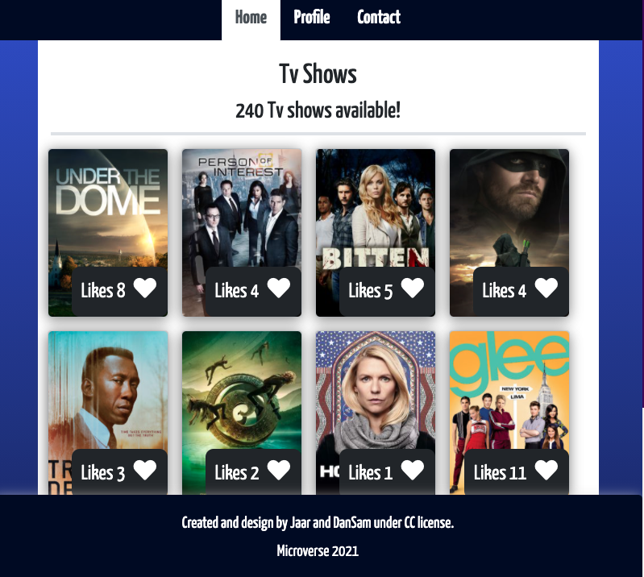
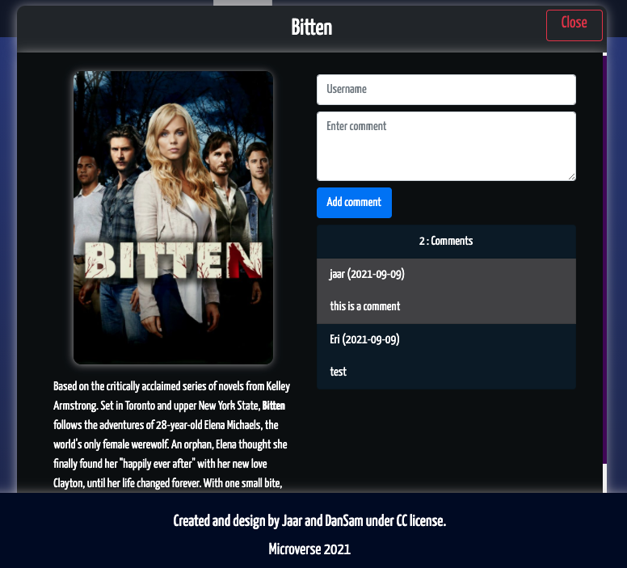

# WEBFLIX (JavaScript Capstone Project)

> The JavaScript capstone project is about building our own web application based on an external API(TVmaze API: data about TV series and movies). TVmaze API was selected by the team, because it provides data about a topic that we both like, to enable us build the webapp around it. The webapp will have 2 user interfaces.
- A home page showing a list of items that you can "like."
- A popup window with more data about an item that you can use to comment on it

> In this activity, we worked as a team to prepare a Kanban board with a GitHub project. As this our very first group project in our Microverse journey, a very detailed template was provided by Microverse, using a special script prepared for the team.

  

## Built With

- JavaScript
- HTML & CSS
- Bootstrap
- Webpack
- Jest testing framework
- Git and Github pages
- VSCode
- Linter Checkers

## Deployment Live Demo

- Deployed with gh-pages
  - [Live Demo](https://dansam5k.github.io/Webflix-Index/index.html)

  - [Video Tour](https://youtu.be/ThpSJr0EDbY)

## Getting Started

To get a local copy up and running follow these simple example steps.

### Prerequisites

- IDE to edit and run the code (We use Visual Studio Code 🔥).
- [Node.js](https://nodejs.org/en/download/) already downloaded.
- Webpack - [click here to getting started](https://webpack.js.org/guides/getting-started/).
### Install

To get a local copy up and running follow these simple example steps.
- Open terminal
- Clone this project using the command `git clone https://github.com/DanSam5K/Webflix-Index.git`
- `cd <clone>` folder
- Run `npm install` to install all project dependencies
- Run `npm start` in your local browser or using Live Server in Visual Studio Code.

## Author 👤 

👨‍💻 **Daniel Samuel**

- Github: [DanSam5k](https://github.com/DanSam5k)
- Twitter: [@_dan_sam](https://twitter.com/_dan_sam)
- Linkedin: [dansamuel](https://www.linkedin.com/in/dansamuel/)

👨‍💻 **Jose Alberto Arriaga Ramos**

- GitHub: [@jaarkira](https://github.com/jaarkira )
- Twitter: [@91_jaar](https://twitter.com/91_jaar )
- LinkedIn: [Jose Arriaga](https://www.linkedin.com/in/jaar/)

## 🤝 Contributing

Contributions, issues, and feature requests are welcome!

Feel free to check the [issues page](https://github.com/DanSam5K/Webflix-Index/issues).

## Show your support

Give a ⭐️ if you like this project!

## Acknowledgments

- Hat tip to anyone whose code was used 🔰
- Inspiration 💘
- Microverse program ⚡
- Our standup team 🏹
- Our family's support 🙌

## 📝 License

This project is [MIT](./LICENSE) licensed.
